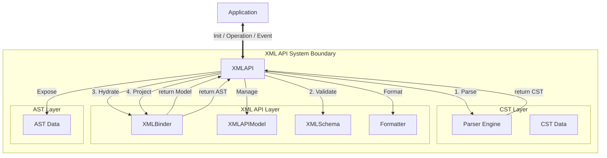

# XML API

This project provides a foundational XML parser and manipulation API designed for WYSIWYG editors and Integrated Development Environments (IDEs). It aims to achieve both intuitive application operation and full fidelity of the source code. By maintaining a bidirectional synchronization between the application view and the source code, it ensures high performance and data integrity.

## Project Goals

The project aims to provide an editing infrastructure that satisfies the following requirements.

1.  Intuitive Operation: The application layer can manipulate XML using an interface similar to the Document Object Model (DOM).
2.  Full Fidelity: Automated edits must not alter any whitespace, indentation, or comments in parts of the code that are not explicitly modified.
3.  Bidirectional Synchronization:
    *   Source to Application: Edits in the source code are reflected in the application model immediately.
    *   Application to Source: Operations in the application are converted into minimal text patches for the source code, preserving existing formatting.
4.  Domain Suitability: The system recognizes schema-specific rules, such as void elements in XHTML5, to ensure valid edits.

## Architecture

The project adopts a three-layer architecture to separate the concerns of text fidelity and operational ease.

### Layer Structure

| Layer | Name | Role | Configuration |
| :--- | :--- | :--- | :--- |
| CST Layer | CST | Represents the physical structure of the source code. | Grammar |
| XML API Layer | XMLAPIModel | Represents the logical model and manages state. | XMLSchema |
| AST Layer | AST | Represents the view model for the application. | - |

### Layer Details

#### CST Layer: CST
The Concrete Syntax Tree maintains all textual information including whitespace, newlines, comments, and attribute quote types. It corresponds directly to the parse result and holds positional information within the source text.

#### XML API Layer: XMLAPIModel
The XMLAPIModel serves as the authoritative model for the system. It resolves the discrepancy between the CST and the AST. It assigns persistent identifiers to nodes to track movement and modification. It preserves formatting information to ensure that edits respect the original style of the code.

#### AST Layer: AST
The Application Abstract Syntax Tree is the data model used by the application. It provides a simplified interface with properties such as tag names, attributes, and children. It supports standard elements, text nodes, and comments, hiding the complexity of the CST and the internal management logic of the XMLAPIModel.

## Architecture Under Consideration

### AST Design Strategy: Native DOM vs. Custom Wrapper

To achieve the dual goals of utilizing standard Web APIs and maintaining strict source fidelity, the project is currently conducting a feasibility study (Phase 0) to compare two architectural approaches.

#### Option A: Native XMLDocument Integration

This approach involves projecting the CST/Model directly into a native `XMLDocument` (using browser DOM or `jsdom`).
*   **Pros**: Full compatibility with standard Web APIs (XPath, QuerySelector, etc.) out of the box.
*   **Cons**: Potential loss of formatting fidelity (whitespace, attribute quotes) due to native parser normalization. Synchronization of mutations back to the source is complex.

#### Option B: DOM-Compatible Custom AST (Selected)

This approach involves implementing a custom AST that mimics the W3C DOM interfaces (`Node`, `Element`, `Document`) but is backed internally by the `XMLAPIModel`.
*   **Pros**: Full control over fidelity and source mapping. Direct linkage to the CST. High performance.
*   **Cons**: Requires reimplementing standard DOM methods and traversal logic.

**Decision**: Option B was selected because it is the only approach that guarantees the "Full Fidelity" requirement. Native DOM implementations (Option A) were found to normalize formatting during serialization, which is unacceptable for this project's goals. See `docs/architecture_comparison.md` for details.

## System Components

The system is organized around the XMLAPI, which acts as a mediator.

### Component Map



### Component Descriptions

1.  XMLAPI: The central mediator and controller. It manages the lifecycle of the system and serves as the single entry point for external applications. It orchestrates the flow of data between the Parser, Binder, and Schema.
2.  XMLBinder: A logic engine that handles data synchronization and transformation. It performs hydration from CST to Model, reconciliation of changes, and generation of text patches. It supports elements, text, and comments.
3.  XMLAPIModel: The data structure definition for the logical model managed by the XMLAPI. It holds data and state but does not contain business logic.
4.  Parser: An engine that parses input strings into a CST based on the defined Grammar.
5.  XMLSchema: A definition of validation rules specific to the application domain.
6.  Formatter: Handles the conversion of AST back to XML string. It prioritizes fidelity by preserving existing whitespace and comments by default, but also supports forced re-formatting with customizable indentation and newline styles.

## Validation Scenarios

This section describes how the architecture fulfills the requirements through specific use cases.

### Scenario 1: Initialization
When the application starts, the XMLAPI initializes the system using the provided source code and XMLSchema. The Mediator invokes the Parser to generate the CST, then uses the Binder to hydrate the XMLAPIModel and project the AST.

### Scenario 2: Source Synchronization
When the user edits the source code, the XMLAPI performs an incremental parse to update the CST. The Binder reconciles the changes with the existing XMLAPIModel, preserving node identity. The updated model is then projected to the AST, and the application is notified of the changes.

### Scenario 3: Application Synchronization
When the user modifies the AST, such as adding an attribute, the XMLAPI resolves the corresponding XMLAPIModel node. The Binder calculates a minimal text patch based on the formatting information in the model. The XMLAPI applies this patch to the source code.

### Scenario 4: Node Movement
When a node is moved within the application, the Binder calculates a patch that removes the node from its original location and inserts it at the new location. The Binder adjusts indentation to match the new context.

### Scenario 5: Fidelity & Formatting
The Formatter ensures that the generated XML maintains the original style of the source code. It respects existing indentation and newlines found in the AST. Alternatively, the application can request a forced re-format to apply a consistent style (e.g., changing 2-space indentation to 4-space) across the document.

### Scenario 6: Extended Structure Support
Handles CDATA sections and Comments as distinct nodes in the AST, preserving their format during parsing and serialization. This allows applications to safely edit comments and raw text data without corruption.

### Scenario 7: Smart Formatting
Automatically detects indentation style from the surrounding code when inserting new nodes. This "Context-Aware Formatting" ensures that automated edits blend seamlessly with the existing code style, respecting user preferences for tabs or spaces.

## Directory Structure

```
.
├── src/
│   ├── main.ts
│   ├── integration.test.ts
│   │
│   └── core/
│       ├── xml-api.ts
│       ├── xml-api-events.ts
│       ├── history-manager.ts
│       │
│       ├── cst/
│       │   ├── parser.ts
│       │   ├── grammar.ts
│       │   ├── xml-grammar.ts
│       │   └── xml-cst.ts
│       │
│       ├── model/
│       │   ├── xml-api-model.ts
│       │   ├── xml-binder.ts
│       │   ├── xml-schema.ts
│       │   └── formatter.ts
│       │
│       └── ast/
│           └── xml-ast.ts
```

## Development Guide

### Directory Structure Strategy

To balance stability and experimental refactoring, we use a separated directory structure.

*   `src/core/`: Contains the stable, production-ready code organized by the 3-layer architecture (CST, Model, AST).
    *   Rule: Changes here must always pass `pnpm test`.
*   `src/experiments/`: Contains experimental code (`minimum-*.ts`) and prototypes for large-scale changes.
    *   Rule: Use this space for "wip" features. It is isolated from the core test suite. To test safe refactoring, copy core files here, modify them, and verify, before merging back to core.

### Testing Commands

*   `pnpm test`: Runs tests for the stable `src/core/` directory. Use this for standard development and CI.
*   `pnpm test:wip`: Runs tests for `src/experiments/`. Use this when iterating on experimental features.
*   `pnpm test:all`: Runs all tests.
