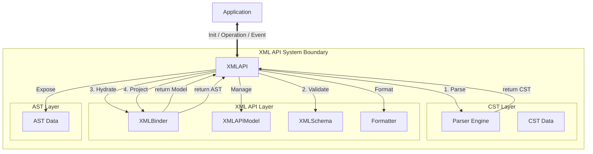

# Core Concepts

The project adopts a three-layer architecture to separate the concerns of text fidelity and operational ease.

## Layer Structure

| Layer | Name | Role | Configuration |
| :--- | :--- | :--- | :--- |
| **CST Layer** | CST | Represents the physical structure of the source code. | Grammar |
| **XML API Layer** | XMLAPIModel | Represents the logical model and manages state. | XMLSchema |
| **AST Layer** | AST | Represents the view model for the application. | - |

## Layer Details

### CST Layer: Concrete Syntax Tree
The CST maintains all textual information including whitespace, newlines, comments, and attribute quote types. It corresponds directly to the parse result and holds positional information within the source text.

### XML API Layer: XMLAPIModel
The `XMLAPIModel` serves as the authoritative model for the system. It resolves the discrepancy between the CST and the AST. It assigns persistent identifiers to nodes to track movement and modification. It preserves formatting information to ensure that edits respect the original style of the code.

### AST Layer: Application Abstract Syntax Tree
The AST is the data model used by the application. It provides a simplified interface with properties such as tag names, attributes, and children. It supports standard elements, text nodes, and comments, hiding the complexity of the CST and the internal management logic of the `XMLAPIModel`.

## Component Map

The system is organized around the `XMLAPI`, which acts as a mediator.

