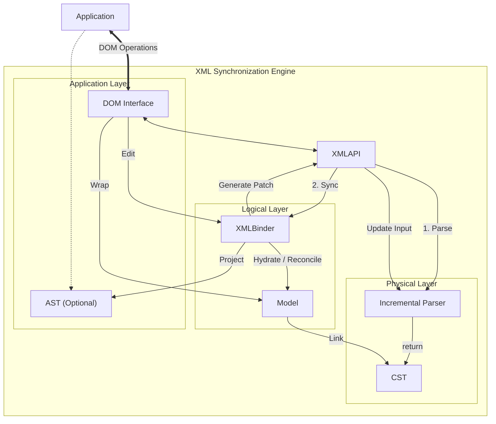

# Core Concepts

This section provides a deeper dive into the architecture of the XML synchronization engine. The system is designed around a layered architecture that bridges the gap between raw source code and application-level object models.

## Architecture Overview

The system consists of three main layers, orchestrated by the central **XMLAPI**.

| Layer | Role | Characteristics |
| :--- | :--- | :--- |
| **CST** (Concrete Syntax Tree) | Physical Layer | Exact source structure, validation, incremental parsing. |
| **Model** | Logical Layer | Source of Truth, persistent IDs, reconciliation. |
| **AST & DOM** | Interface Layer | Standard DOM API, simplified data view, change observation. |

## Layers in Depth

### 1. CST (Concrete Syntax Tree)
The CST is the result of parsing the source code against a strict grammar definition based on the **W3C XML 1.0 Specification**.

- **Full Fidelity**: Captures every character, including whitespace, comments, and attribute quote styles.
- **Validation**: Enforces Well-Formedness Constraints (WFC) such as matching start/end tags and unique attributes during the parsing process.
- **Incremental Parsing**: Supports efficient updates by re-parsing only specific branches of the tree when the input changes (`Parser.parseAt`).

### 2. Model
The Model is the authoritative source of truth that connects the physical CST to the application.

- **Persistent Identity**: Every node is assigned a unique, immutable ID upon creation. This allows external systems (like UI frameworks) to track nodes reliably even after re-parsing.
- **Binder Engine**: The core logic that synchronizes data. It performs **Reconciliation**—intelligently updating the existing Model tree with new CST data to minimize object replacement—and calculates precise text patches for updates.
- **Linkage**: Maintains direct references to CST nodes, enabling the retrieval of exact source code locations for every logical element.

### 3. AST & DOM Interface
This layer provides the interfaces for applications to interact with the document.

- **DOM Interface**: The primary API for manipulation. It implements standard W3C interfaces (`Document`, `Element`) and acts as a wrapper around the Model. Changes made here are observed and automatically synchronized with the source code.
- **AST**: A simplified, read-only tree structure (`xml-ast.ts`). It is lighter than the DOM and is used mainly for data extraction or feeding into the Formatter.

## Data Flow

The system maintains a bidirectional loop between the source code and the application.

