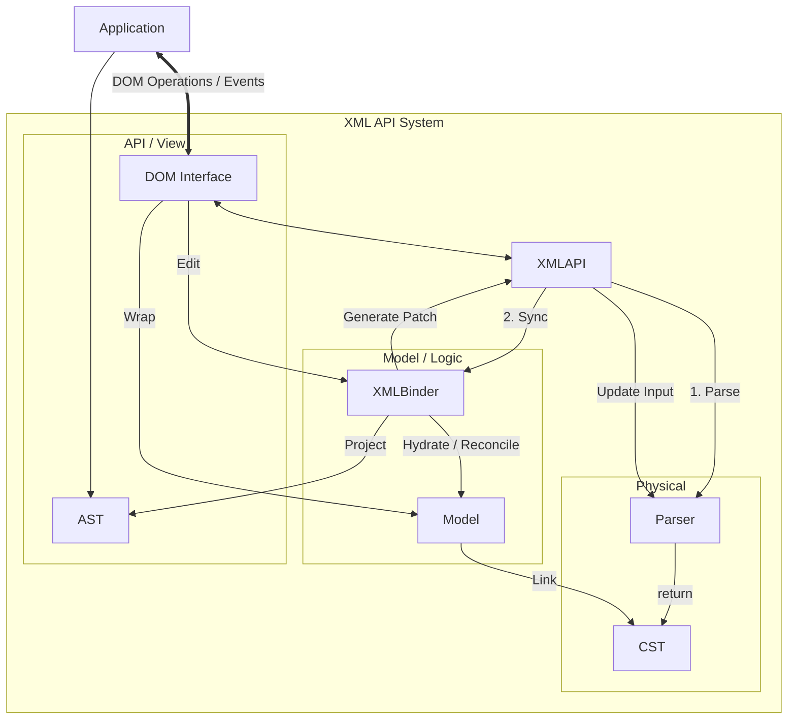

# Core Concepts

The project adopts a layered architecture to separate the concerns of text fidelity and operational ease.

## Layer Structure

| Layer | Name | Role | Characteristics |
| :--- | :--- | :--- | :--- |
| **Physical Layer** | CST | Represents the exact physical structure of the source code. | Positional data, formatting, comments. |
| **Model Layer** | Model | The authoritative source of truth. | Persistent IDs, Reconciliation, Link to CST. |
| **Interface Layer** | DOM | Standard-compatible wrapper for manipulation. | `setAttribute`, `textContent`, `querySelector`. |
| **Semantic Layer** | AST | A simplified projection (Optional). | Tag names, attributes, child nodes. |

## Layer Details

### Physical Layer: CST (Concrete Syntax Tree)
The CST captures every character of the source, including "hidden" data like attribute quote styles, specific whitespace between attributes, and indentation. This layer is crucial for achieving **Full Fidelity**.

### Model Layer: Core Model
The Model is where the "intelligence" of the system resides. It maps CST nodes to logical elements. When the source code changes, the Model performs **Reconciliation**—it compares the new CST with the old Model and updates only the necessary parts. This preserves object identity, which is essential for UI frameworks that bind to these objects.

### Interface Layer: DOM Interface
The DOM layer provides an industry-standard interface. It translates standard operations (like appending a child) into specific requests for the Binder to update the source code.

## Component Map

The system is organized around the `XMLAPI`, which acts as an orchestrator.

